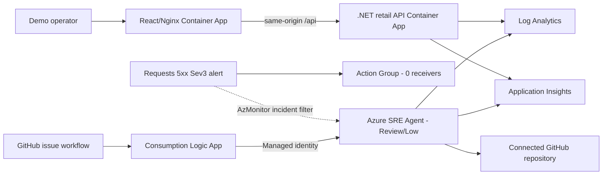

# Mercadona synthetic retail reliability lab

> **Fictional technical SRE demo. Not an official Mercadona system. All stores, products, prices, carts, orders, correlation IDs and metrics are synthetic; no claims about real operations.**

This independent repository demonstrates Azure SRE Agent investigation and Review-mode mitigation against a safe, bounded memory-pressure scenario in a fictional online grocery flow. It does not use real Mercadona systems, data, logos, product imagery, packaging, slogans, proprietary typography, or website assets/layout.

## Experience

The React 19 + TypeScript + MUI 7 frontend uses only a text wordmark, generic icons, Segoe UI/Arial, deep green `#126B3A`, accessible yellow `#F2C94C`, and off-white `#F7FAF5`. Its real API flow is:

1. `GET /api/stores`
2. `GET /api/products/store/{storeId}`
3. `POST /api/carts`
4. `GET /api/carts/{cartId}`
5. `POST /api/carts/{cartId}/items`
6. `POST /api/orders`
7. `GET /api/orders/{orderId}/tracking`

The .NET 9 API emits JSON console logs, listens on port `8080`, exposes `/healthz` and `/api/healthz`, and accepts forwarded headers from Azure Container Apps with explicit known-network/proxy lists cleared.

## Architecture



All regional resources use `eastus2` in the pre-created resource group `rg-mercadona-sre-agent-v1`. The scripts refuse any other subscription than `5305e853-a63b-4b82-9a3f-6fde18c1a798`.

| Resource | Name |
|---|---|
| ACR Basic | deterministic `acrmrcdemo...` |
| Container Apps Environment | `cae-mercadona-demo-v1` |
| Backend / frontend | `ca-mercadona-retail-api` / `ca-mercadona-retail-web` |
| Log Analytics / App Insights | `law-mercadona-demo-v1` / `appi-mercadona-demo-v1` |
| Application / SRE UAMI | `id-mercadona-app-v1` / `id-mercadona-sre-v1` |
| Azure SRE Agent | `sre-agent-mercadona-v1` |
| Alert / action group | `alert-mercadona-cart-5xx-sev3` / `ag-mercadona-sre-demo` |
| Trigger / bridge | `mercadona-controlled-issue` / `logic-mercadona-sre-trigger-v1` |

Every resource uses `purpose=sre-agent-demo`, `environment=demo`, `dataClassification=synthetic`, and `scenario=synthetic-retail`.

## Controlled memory scenario

`DEMO_CART_MEMORY_MB_PER_ADD` is startup-validated from `0` through `10` and defaults to `0`. `DEMO_CART_MEMORY_MAX_MB` is startup-validated from `10` through `640` and defaults to `640`. `DEMO_CART_MEMORY_FAILURE_MB` defaults to `0`; when enabled it must be an exact positive multiple of the per-add value and cannot exceed the cap.

When enabled at `10`, every **valid** cart/product add allocates exactly 10 MiB, touches each memory page, and strongly roots the block in a singleton process-lifetime collection. Invalid carts/products do not allocate. A lock makes the 640 MiB cap atomic under concurrency. With the failure mode disabled, reaching the cap still preserves successful responses. The incident revision sets the safe failure threshold to 600 MiB; subsequent valid adds return HTTP 503 without another allocation or cart mutation. There is no reset endpoint, forced collection, unbounded loop, or uncontrolled out-of-memory path.

Structured events contain `CorrelationId`, `CartId`, `StoreId`, `ProductId`, `Quantity`, `AllocationBytes`, `RetainedBytes`, `MaxRetainedBytes`, `ErrorCode` (`DEMO_CART_MEMORY_RETENTION` or `DEMO_CART_MEMORY_CAPACITY_EXHAUSTED`), and a plainly fictional `RootCauseClue`. No secrets or authentication material are logged.

The Sev3 metric alert evaluates the backend `Requests` total every minute over five minutes with `statusCodeCategory=5xx`, and fires above five failures. The backend remains fixed at one replica so the signal and retained heap stay attributable. Application Insights request telemetry and Log Analytics console events provide the investigation evidence.

## Prerequisites and deployment

- PowerShell 7.2+
- Azure CLI with the Container Apps extension
- .NET 9 SDK and Node.js 22 for local validation
- `az bicep` CLI support
- `gh` CLI for SRE Agent repository/secret configuration
- Pre-created `rg-mercadona-sre-agent-v1`
- Pre-created Arc scope `rg-arcbox-itpro-weu-002`

No script creates the resource group. No script in this repository runs automatically.

```powershell
az login
az account set --subscription 5305e853-a63b-4b82-9a3f-6fde18c1a798
.\scripts\deploy.ps1 -ArcResourceGroupName rg-arcbox-itpro-weu-002
```

`deploy.ps1` performs two convergent Bicep passes: placeholder images first, remote ACR builds from each project directory second, then immutable tagged images. Before each create it requests full JSON what-if payloads and aborts if either the retail or Arc managed-resource ID would be removed from the SRE Agent, or if the deployment unexpectedly mutates an Arc-scope resource. It waits for `Healthy` plus `Running`, `RunningAtMinScale`, or `RunningAtMaxScale`, then verifies API health, stores, cart, valid add, order, tracking, frontend text, and same-origin health. Created responses retain `-MaximumRedirection 0`.

Configure the independent agent only after infrastructure succeeds:

```powershell
.\scripts\configure-sre-agent.ps1 -SetGitHubSecret
```

The script preserves strict, idempotent configuration: Review/Low, Anthropic/Automatic, AzMonitor, 1000 monthly units, Preview upgrades, SRE UAMI action identity, Log Analytics and App Insights connectors, non-destructive repository reuse, and no redirects. The current data-plane API stores GitHub connector authentication as a host domain; the script requires that domain plus CodeRepo `Ready`, selects the catalog's exact issue/branch/commit/PR tools, and fails as `INCOMPLETE` if OAuth needs the one-time manual step **Builder > Connectors > GitHub OAuth > Sign in**. It never prints tokens.

The `incident-handler` and `mercadona-cart-5xx-sev3` response plan correlate 5xx telemetry, retained-byte logs, active revision, and repository evidence. The plan is limited by exact alert ID, title, Sev3 and backend resource, and known quickstart plans are removed without touching Arc filters. Global tool policy asks before Azure/GitHub writes and denies merge, workflow and deploy tools.

## Run the incident and recover

```powershell
.\scripts\start-incident.ps1
```

Expected result in roughly 3-10 minutes:

- a new healthy backend revision with 10 MiB per valid add and a 600 MiB controlled failure threshold;
- a finite injector capped at 80 requests and five minutes;
- at least six real HTTP 503 responses, each with its correlation ID, after the safe threshold;
- `Requests` 5xx observed above five and `alert-mercadona-cart-5xx-sev3` Fired;
- a new SRE Agent thread routed to `mercadona-cart-5xx-sev3`;
- no automatic recovery, merge or deployment.

**Recovery is mandatory immediately after the observation:**

```powershell
.\scripts\recover-incident.ps1
```

Recovery creates a new process with both demo memory variables at zero when injection is active, or safely reuses the healthy revision when already disabled. It verifies cart/add/order/tracking and waits for the exact alert to resolve. The old retained heap disappears with the old revision.

If the metric alert is delayed, use the workflow's **Run workflow** action with an ID beginning `SYNTH-`. This is an emergency demonstration fallback, not a bypass of Review mode.

## GitHub bridge safety

The workflow runs only for an exact `sre-investigate` label on a title beginning `[SYNTHETIC]`, or a manual ID beginning `SYNTH-`. It builds JSON with `jq`, uses only `SRE_TRIGGER_URL`, performs no Azure login/OIDC flow, sends no authorization header, and requires HTTP `202`, `success=true`, and a nonempty `threadId`.

`logic-mercadona-sre-trigger-v1` receives the signed callback request, forwards the original JSON to the protected trigger with system-assigned managed identity and audience `https://azuresre.dev`, disables retries and async polling, secures HTTP inputs, propagates downstream status/body/content type, and emits `502` only when there is no downstream response. Its identity has only built-in SRE Agent Standard User at the exact agent scope. The callback is never an ARM output.

Create a sample issue:

```powershell
.\scripts\create-sample-issue.ps1
```

## Observability

Retained-byte events:

```kusto
ContainerAppConsoleLogs_CL
| where ContainerAppName_s == "ca-mercadona-retail-api"
| where Log_s has_any ("DEMO_CART_MEMORY_RETENTION", "DEMO_CART_MEMORY_CAPACITY_EXHAUSTED")
| project TimeGenerated, RevisionName_s, Log_s
| order by TimeGenerated desc
```

Revision trend:

```kusto
ContainerAppConsoleLogs_CL
| where ContainerAppName_s == "ca-mercadona-retail-api"
| where Log_s has "RetainedBytes"
| summarize Events=count() by RevisionName_s, bin(TimeGenerated, 1m)
| order by TimeGenerated desc
```

Query the platform metric:

```powershell
$id = "/subscriptions/5305e853-a63b-4b82-9a3f-6fde18c1a798/resourceGroups/rg-mercadona-sre-agent-v1/providers/Microsoft.App/containerApps/ca-mercadona-retail-api"
az monitor metrics list --resource $id --metric Requests --aggregation Total --filter "statusCodeCategory eq '5xx'" --interval PT1M
```

Detailed response procedures are in [`docs/runbooks/cart-memory-pressure.md`](docs/runbooks/cart-memory-pressure.md). The guided Spanish walkthrough is [`docs/guia-demo-paso-a-paso.md`](docs/guia-demo-paso-a-paso.md), and the presenter script is [`docs/guion-demo-paridad-grubify.md`](docs/guion-demo-paridad-grubify.md).

## Additive Azure Arc identity POC

An isolated extension models an ADFS/domain-controller observability scenario on the existing ArcBox lab. Azure Arc, AMA, DCR, Log Analytics, alerts, and SRE Agent plumbing are real; `Mercadona.IdentityOps` events are explicitly synthetic (`demoSynthetic=true`) because the lab hosts do not run AD FS or AD DS. The additive DCR is events-only and reuses existing VM Insights data from `InsightsMetrics` rather than duplicating performance ingestion. The extension does not change the retail UI/API or replace existing ArcBox DCR associations.

Azure Resource Manager may redact the connector workspace target in GET responses. Configuration and verification accept blank `dataSource`/extended target fields as provider-redacted, while still requiring the dedicated connector name, `LogAnalytics` type, expected UAMI, successful state when returned, and rejecting every observable nonblank target mismatch.

Planning is the default and performs no deployment:

```powershell
.\scripts\deploy-arc-identity.ps1
.\scripts\configure-arc-identity-sre-agent.ps1
```

The Spanish architecture, production mapping, exact approved command sequence, daily ArcBox dependency, demo flow, rollback, governance, and cost controls are documented in:

- [`docs/arquitectura-identidad-arc.md`](docs/arquitectura-identidad-arc.md);
- [`docs/runbooks/arc-identidad-operaciones.md`](docs/runbooks/arc-identidad-operaciones.md);
- [`docs/guia-demo-identidad-arc.md`](docs/guia-demo-identidad-arc.md).

## Local validation

```powershell
dotnet restore .\MercadonaRetailDemo.sln
dotnet build .\MercadonaRetailDemo.sln --no-restore
dotnet test .\MercadonaRetailDemo.sln --no-build

Push-Location .\mercadona-retail-frontend
npm ci
$env:CI = 'true'
npm test -- --runInBand --watchAll=false
npm run build
Pop-Location

az bicep build --file .\infra\main.bicep
az bicep lint --file .\infra\main.bicep
az bicep build --file .\infra\trigger-bridge.bicep
az bicep lint --file .\infra\trigger-bridge.bicep
az bicep build --file .\infra\arc-identity.bicep
az bicep lint --file .\infra\arc-identity.bicep
pwsh -NoProfile -File .\scripts\test-configure-sre-agent-contract.ps1
pwsh -NoProfile -File .\scripts\test-azure-demo-common-contract.ps1
pwsh -NoProfile -File .\scripts\test-retail-incident-contract.ps1
pwsh -NoProfile -File .\scripts\test-arc-identity-contract.ps1
pwsh -NoProfile -File .\scripts\test-sre-agent-what-if-contract.ps1
```

## Cost, cleanup, and reset

The demo incurs normal charges for Container Apps, Log Analytics ingestion/retention, Application Insights, ACR, Logic Apps, Azure Monitor, and Azure SRE Agent units. Keep runs short, inspect current Azure pricing, and avoid leaving the incident enabled.

Reset checklist:

1. Run `.\scripts\recover-incident.ps1`.
2. Confirm the active revision is healthy and both `DEMO_CART_MEMORY_MB_PER_ADD=0` and `DEMO_CART_MEMORY_FAILURE_MB=0`.
3. Confirm no new 5xx is produced and the exact Sev3 alert has resolved.
4. Close synthetic issues and review agent threads.
5. Remove `SRE_TRIGGER_URL` when retiring the demo.
6. With owner approval, delete only resources tagged `purpose=sre-agent-demo` in the guarded resource group and remove their dedicated RBAC assignments.

## Troubleshooting

| Symptom | Safe check |
|---|---|
| Azure context guard fails | `az account show`; never bypass the exact subscription/resource-group check |
| Revision does not become healthy | `az containerapp revision list -g rg-mercadona-sre-agent-v1 -n ca-mercadona-retail-api -o table` |
| Metric is delayed | Wait for platform ingestion; use manual `SYNTH-` workflow only for the demo, then recover |
| Alert does not fire | Confirm six real 5xx responses, one backend replica, exact alert enabled, and `Requests` filtered to `statusCodeCategory=5xx` |
| Workflow lacks `202` | Check the Logic App state and exact agent-scope Standard User assignment; never expose the protected trigger |
| Repository or GitHub capabilities are incomplete | Complete **Builder > Connectors > GitHub OAuth** authentication, enable issue/contents/PR writes, then rerun configuration |
