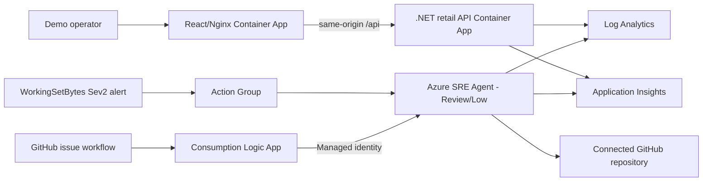

# Mercadona synthetic retail reliability lab

> **Fictional technical SRE demo. Not an official Mercadona system. All stores, products, prices, carts, orders, correlation IDs and metrics are synthetic; no claims about real operations.**

This independent repository demonstrates Azure SRE Agent investigation and Review-mode mitigation against a safe, bounded memory-pressure scenario in a fictional online grocery flow. It does not use real Mercadona systems, data, logos, product imagery, packaging, slogans, proprietary typography, or website assets/layout.

## Experience

The React 19 + TypeScript + MUI 7 frontend uses only a text wordmark, generic icons, Segoe UI/Arial, deep green `#126B3A`, accessible yellow `#F2C94C`, and off-white `#F7FAF5`. Its real API flow is:

1. `GET /api/stores`
2. `GET /api/products/store/{storeId}`
3. `POST /api/carts`
4. `GET /api/carts/{cartId}`
5. `POST /api/carts/{cartId}/items`
6. `POST /api/orders`
7. `GET /api/orders/{orderId}/tracking`

The .NET 9 API emits JSON console logs, listens on port `8080`, exposes `/healthz` and `/api/healthz`, and accepts forwarded headers from Azure Container Apps with explicit known-network/proxy lists cleared.

## Architecture



All regional resources use `eastus2` in the pre-created resource group `rg-mercadona-sre-agent-v1`. The scripts refuse any other subscription than `5305e853-a63b-4b82-9a3f-6fde18c1a798`.

| Resource | Name |
|---|---|
| ACR Basic | deterministic `acrmrcdemo...` |
| Container Apps Environment | `cae-mercadona-demo-v1` |
| Backend / frontend | `ca-mercadona-retail-api` / `ca-mercadona-retail-web` |
| Log Analytics / App Insights | `law-mercadona-demo-v1` / `appi-mercadona-demo-v1` |
| Application / SRE UAMI | `id-mercadona-app-v1` / `id-mercadona-sre-v1` |
| Azure SRE Agent | `sre-agent-mercadona-v1` |
| Alert / action group | `alert-mercadona-cart-memory` / `ag-mercadona-sre-demo` |
| Trigger / bridge | `mercadona-controlled-issue` / `logic-mercadona-sre-trigger-v1` |

Every resource uses `purpose=sre-agent-demo`, `environment=demo`, `dataClassification=synthetic`, and `scenario=synthetic-retail`.

## Controlled memory scenario

`DEMO_CART_MEMORY_MB_PER_ADD` is startup-validated from `0` through `10` and defaults to `0`. `DEMO_CART_MEMORY_MAX_MB` is startup-validated from `10` through `640` and defaults to `640`.

When enabled at `10`, every **valid** cart/product add allocates exactly 10 MiB, touches each memory page, and strongly roots the block in a singleton process-lifetime collection. Invalid carts/products do not allocate. A lock makes the 640 MiB cap atomic under concurrency. Reaching the cap never changes the successful add response; there is no reset endpoint, forced collection, unbounded loop, or uncontrolled out-of-memory path.

Structured events contain `CorrelationId`, `CartId`, `StoreId`, `ProductId`, `Quantity`, `AllocationBytes`, `RetainedBytes`, `MaxRetainedBytes`, `ErrorCode=DEMO_CART_MEMORY_RETENTION`, and a plainly fictional `RootCauseClue`. No secrets or authentication material are logged.

The Sev2 metric alert evaluates the backend `WorkingSetBytes` maximum every minute over five minutes and fires above `629145600` bytes (600 MiB). The backend is fixed at one replica so the signal stays attributable. The 600 MiB threshold leaves about 40 MiB between alert crossing and the 640 MiB retention cap; validate the healthy baseline is comfortably below threshold before each demonstration.

## Prerequisites and deployment

- PowerShell 7.2+
- Azure CLI with the Container Apps extension
- .NET 9 SDK and Node.js 22 for local validation
- `az bicep` CLI support
- `gh` CLI for SRE Agent repository/secret configuration
- Pre-created `rg-mercadona-sre-agent-v1`

No script creates the resource group. No script in this repository runs automatically.

```powershell
az login
az account set --subscription 5305e853-a63b-4b82-9a3f-6fde18c1a798
.\scripts\deploy.ps1
```

`deploy.ps1` performs two convergent Bicep passes: placeholder images first, remote ACR builds from each project directory second, then immutable tagged images. It waits for `Healthy` plus `Running`, `RunningAtMinScale`, or `RunningAtMaxScale`, then verifies API health, stores, cart, valid add, order, tracking, frontend text, and same-origin health. Created responses retain `-MaximumRedirection 0`.

Configure the independent agent only after infrastructure succeeds:

```powershell
.\scripts\configure-sre-agent.ps1 -SetGitHubSecret
```

The script preserves strict, idempotent configuration: Review/Low, Anthropic/Automatic, AzMonitor, 1000 monthly units, Preview upgrades, SRE UAMI action identity, Log Analytics and App Insights connectors, non-destructive repository reuse with null/main branch tolerance, and no redirects. The `code-analyzer` subagent and `mercadona-cart-memory-sev2` filter correlate working-set telemetry, retained-byte logs, active revision, and repository evidence. They may propose only `DEMO_CART_MEMORY_MB_PER_ADD=0`; writes always require explicit approval.

## Run the incident and recover

```powershell
.\scripts\start-incident.ps1
```

Expected result in roughly 3-10 minutes:

- a new healthy backend revision with 10 MiB per valid add;
- one synthetic cart and exactly 64 sequential successful adds within five minutes;
- correlation IDs in every response;
- retained bytes capped at 640 MiB;
- `WorkingSetBytes` observed above 600 MiB;
- Sev2 alert and SRE Agent investigation, subject to Azure Monitor latency.

**Recovery is mandatory immediately after the observation:**

```powershell
.\scripts\recover-incident.ps1
```

Recovery creates a new process when retention is active, or safely reuses the healthy revision when it is already disabled. It verifies cart/add/order/tracking and checks for a below-threshold sample. The old retained heap disappears with the old revision.

If the metric alert is delayed, use the workflow's **Run workflow** action with an ID beginning `SYNTH-`. This is an emergency demonstration fallback, not a bypass of Review mode.

## GitHub bridge safety

The workflow runs only for an exact `sre-investigate` label on a title beginning `[SYNTHETIC]`, or a manual ID beginning `SYNTH-`. It builds JSON with `jq`, uses only `SRE_TRIGGER_URL`, performs no Azure login/OIDC flow, sends no authorization header, and requires HTTP `202`, `success=true`, and a nonempty `threadId`.

`logic-mercadona-sre-trigger-v1` receives the signed callback request, forwards the original JSON to the protected trigger with system-assigned managed identity and audience `https://azuresre.dev`, disables retries and async polling, secures HTTP inputs, propagates downstream status/body/content type, and emits `502` only when there is no downstream response. Its identity has only built-in SRE Agent Standard User at the exact agent scope. The callback is never an ARM output.

Create a sample issue:

```powershell
.\scripts\create-sample-issue.ps1
```

## Observability

Retained-byte events:

```kusto
ContainerAppConsoleLogs_CL
| where ContainerAppName_s == "ca-mercadona-retail-api"
| where Log_s has "DEMO_CART_MEMORY_RETENTION"
| project TimeGenerated, RevisionName_s, Log_s
| order by TimeGenerated desc
```

Revision trend:

```kusto
ContainerAppConsoleLogs_CL
| where ContainerAppName_s == "ca-mercadona-retail-api"
| where Log_s has "RetainedBytes"
| summarize Events=count() by RevisionName_s, bin(TimeGenerated, 1m)
| order by TimeGenerated desc
```

Query the platform metric:

```powershell
$id = "/subscriptions/5305e853-a63b-4b82-9a3f-6fde18c1a798/resourceGroups/rg-mercadona-sre-agent-v1/providers/Microsoft.App/containerApps/ca-mercadona-retail-api"
az monitor metrics list --resource $id --metric WorkingSetBytes --aggregation Maximum --interval PT1M
```

Detailed response procedures are in [`docs/runbooks/cart-memory-pressure.md`](docs/runbooks/cart-memory-pressure.md). The guided Spanish walkthrough is [`docs/guia-demo-paso-a-paso.md`](docs/guia-demo-paso-a-paso.md).

## Local validation

```powershell
dotnet restore .\MercadonaRetailDemo.sln
dotnet build .\MercadonaRetailDemo.sln --no-restore
dotnet test .\MercadonaRetailDemo.sln --no-build

Push-Location .\mercadona-retail-frontend
npm ci
$env:CI = 'true'
npm test -- --runInBand --watchAll=false
npm run build
Pop-Location

az bicep build --file .\infra\main.bicep
az bicep lint --file .\infra\main.bicep
az bicep build --file .\infra\trigger-bridge.bicep
az bicep lint --file .\infra\trigger-bridge.bicep
pwsh -NoProfile -File .\scripts\test-configure-sre-agent-contract.ps1
```

## Cost, cleanup, and reset

The demo incurs normal charges for Container Apps, Log Analytics ingestion/retention, Application Insights, ACR, Logic Apps, Azure Monitor, and Azure SRE Agent units. Keep runs short, inspect current Azure pricing, and avoid leaving the incident enabled.

Reset checklist:

1. Run `.\scripts\recover-incident.ps1`.
2. Confirm the active revision is healthy and `DEMO_CART_MEMORY_MB_PER_ADD=0`.
3. Confirm `WorkingSetBytes` is below 600 MiB and the alert has resolved.
4. Close synthetic issues and review agent threads.
5. Remove `SRE_TRIGGER_URL` when retiring the demo.
6. With owner approval, delete only resources tagged `purpose=sre-agent-demo` in the guarded resource group and remove their dedicated RBAC assignments.

## Troubleshooting

| Symptom | Safe check |
|---|---|
| Azure context guard fails | `az account show`; never bypass the exact subscription/resource-group check |
| Revision does not become healthy | `az containerapp revision list -g rg-mercadona-sre-agent-v1 -n ca-mercadona-retail-api -o table` |
| Metric is delayed | Wait for platform ingestion; use manual `SYNTH-` workflow only for the demo, then recover |
| Alert does not fire | Confirm healthy baseline, one backend replica, alert enabled, and maximum above `629145600` |
| Workflow lacks `202` | Check the Logic App state and exact agent-scope Standard User assignment; never expose the protected trigger |
| Repository indexing is incomplete | Complete GitHub authentication in Azure SRE Agent, then rerun configuration |
