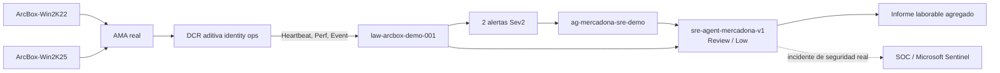

# Arquitectura: observabilidad de identidad sobre Azure Arc

> **Fictional technical SRE demo. Not an official Mercadona system. All stores, products, prices, carts, orders, correlation IDs and metrics are synthetic; no claims about real operations.**

## Alcance

Esta extensión añade una prueba de concepto de infraestructura de identidad al laboratorio existente sin modificar la aplicación retail ni recursos de Jumpstart. El objetivo es demostrar investigación y reporting con Azure SRE Agent sobre:

- transporte real mediante Azure Arc, Azure Monitor Agent (AMA), Data Collection Rules (DCR) y Log Analytics;
- telemetría real y genérica de los dos hosts Windows;
- eventos de servicio de identidad **sintéticos**, identificados siempre con `demoSynthetic=true`.

Los hosts del laboratorio no ejecutan AD DS ni AD FS. Ningún evento `Mercadona.IdentityOps` representa una autenticación, un usuario, un token o un incidente real.

## Qué es real y qué es sintético

| Componente o señal | Naturaleza | Límite |
|---|---|---|
| `ArcBox-Win2K22` y `ArcBox-Win2K25` conectados a Azure Arc | Real del laboratorio | No son DC ni servidores AD FS |
| `AzureMonitorWindowsAgent`, asociaciones DCR, `Heartbeat` y `Perf` | Real del laboratorio | Solo estado y rendimiento genérico del host |
| Eventos System/Application de nivel Critical, Error y Warning | Real del host | No se interpretan automáticamente como incidentes de identidad |
| Fuente Application `Mercadona.IdentityOps`, IDs 4101/4102 | Sintética | JSON con `demoSynthetic=true`; nunca se etiqueta como AD FS/DC genuino |
| Alertas, acción de Azure Monitor y análisis de Azure SRE Agent | Plumbing real | El incidente que activa 4101 es sintético |
| Recomendaciones del agente | Generadas para la demo | Siempre `Review/Low`; no hay remediación autónoma |

## Línea base real observada

La auditoría previa del 14 de julio de 2026 confirmó:

- `la-start-arcbox-client` habilitada, con ejecución diaria a las 08:00 en `Romance Standard Time`; sus cinco ejecuciones más recientes finalizaron correctamente;
- `shutdown-computevm-ArcBox-Client` habilitado con autoapagado diario a las 18:00 UTC;
- los cinco invitados anidados en ejecución, con Hyper-V `AutomaticStartAction=Start` y `AutomaticStopAction=ShutDown`;
- `Heartbeat` e `InsightsMetrics` recientes para los cinco invitados;
- Change Tracking presente en tres invitados Windows;
- ninguna fila todavía en `Event`, `SecurityEvent` o `Perf`;
- la DCR existente de VM Insights entrega `InsightsMetrics` y debe conservarse.

Esta extensión no crea automatización de arranque. Añade `Perf` y `Event` únicamente para los dos Windows objetivo después del despliegue de su DCR dedicada. La ausencia de esas tablas antes del primer despliegue es la línea base esperada, no un fallo de ArcBox.

La ventana auditada de dos horas aporta esta referencia informativa para correlación:

| Host | CPU media / p95 | Memoria disponible | Latencia de disco | Espacio libre |
|---|---:|---:|---:|---:|
| `ArcBox-Win2K22` | 4,38 % / 11,51 % | ~2,53 GB | ~1 ms | 80,31 % |
| `ArcBox-Win2K25` | 9,71 % / 19,32 % | ~2,19 GB | ~1,1-1,3 ms | 58,73 % |

Estos valores no son umbrales de alerta ni SLO. En este primer POC, CPU, memoria, disco y red se usan solo para correlación e informes. No existe una alerta Sev2 por valor de rendimiento: la regla cuantitativa determinista es la ráfaga sintética acotada; la otra Sev2 detecta ausencia de Heartbeat/Perf durante la ventana operativa, no degradación de sus valores.

## Flujo

## Recursos aditivos

La orquestación [`infra/arc-identity.bicep`](../infra/arc-identity.bicep) se ejecuta a nivel de suscripción y despliega un módulo únicamente dentro de `rg-arcbox-itpro-weu-002`.

| Recurso | Nombre | Comportamiento |
|---|---|---|
| DCR Windows | `dcr-arcbox-identity-ops` | Nueva; no reemplaza la DCR de VM Insights |
| Asociación DCR | `assoc-arcbox-identity-ops` | Nueva y solo en los dos Windows objetivo |
| Alerta de ráfaga | `alert-arcbox-identity-token-failure-burst` | Sev2, umbral 8 eventos/5 min, auto-resolve |
| Alerta de frescura | `alert-arcbox-identity-data-freshness` | Sev2 si Heartbeat o Perf supera 10 min dentro de 08:20 Europe/Madrid-18:00 UTC, auto-resolve |

Las alertas reutilizan `ag-mercadona-sre-demo`. Actualmente el action group está habilitado y tiene cero receptores de forma intencionada; esta extensión solo referencia su ID y no añade notificaciones. No se crean receptores, identidades, workspaces, extensiones de máquina ni resource groups.

Los `displayName` de las dos reglas empiezan por `ArcBox IdentityOps`. El filtro nuevo usa ese mismo prefijo para no solaparse con el filtro retail existente, que selecciona títulos con `mercadona` y puede delegar en un subagente con herramientas de escritura.

## Colección y control de volumen

La DCR usa una frecuencia de 60 segundos y únicamente:

- `\Processor(_Total)\% Processor Time`;
- `\Memory\Available MBytes`;
- latencia de lectura/escritura de `LogicalDisk(_Total)`;
- `% Free Space`;
- `\Network Interface(*)\Bytes Total/sec`;
- `Mercadona.IdentityOps` 4101/4102;
- Critical, Error y Warning de System/Application, excluyendo la fuente sintética de la consulta genérica.

No se ingiere de forma amplia el canal Security. Los principales controles de coste son dos hosts, frecuencia de 60 segundos, XPath limitado, dos reglas de alerta y el volumen de consultas/unidades del SRE Agent. La extensión no cambia retención, compromiso, SKU ni configuración de `law-arcbox-demo-001`.

## Configuración del Azure SRE Agent

[`scripts/configure-arc-identity-sre-agent.ps1`](../scripts/configure-arc-identity-sre-agent.ps1) añade de forma idempotente:

- Reader y Monitoring Reader en el resource group ArcBox;
- Log Analytics Reader solo en `law-arcbox-demo-001`;
- conector LAW `arcbox-log-analytics` con `id-mercadona-sre-v1`;
- subagente `identity-infrastructure-analyzer`;
- skill `identity-infrastructure-operations` y herramientas de lectura;
- filtro `identity-infrastructure-sev2` para Sev2;
- tarea `identity-infrastructure-weekday-report`, `30 7 * * 1-5` UTC, en Review.

No se añade `RunAzCliWriteCommands`. El agente debe:

1. distinguir siempre plumbing/host real de eventos de identidad sintéticos;
2. usar agregados sin nombres de usuario ni muestras de mensajes;
3. no instalar roles, cambiar políticas, tocar Security ni reiniciar servicios;
4. someter recomendaciones a revisión humana;
5. derivar incidentes de seguridad reales al SOC y Microsoft Sentinel.

`change-tracking.kql` es una consulta opcional: solo devuelve agregados si ArcBox ya proporciona la tabla `ConfigurationChange`. Esta extensión no instala ni habilita Change Tracking; el informe debe declarar la señal como no disponible en vez de inferir cambios o activarla.

La identidad ya puede tener permisos fuera de ArcBox por necesidades del escenario retail. Esta extensión no los amplía, reemplaza ni retira: sus únicas adiciones son Reader y Monitoring Reader en el RG ArcBox y Log Analytics Reader en el workspace ArcBox.

## Ventana operativa, UTC y DST

La Logic App inicia `ArcBox-Client` a las 08:00 de `Romance Standard Time`, equivalente a `Europe/Madrid`. La alerta de frescura usa la función KQL `datetime_utc_to_local(..., "Europe/Madrid")`, por lo que respeta automáticamente CET (UTC+1) y CEST (UTC+2), y comienza a evaluar a las 08:20 locales tras 20 minutos de gracia. Deja de devolver filas a las 18:00 UTC, cuando actúa `shutdown-computevm-ArcBox-Client`; esto equivale a las 19:00 CET o 20:00 CEST. La ausencia nocturna de Heartbeat/Perf es esperada y no genera alerta.

El informe laborable usa cron UTC `30 7 * * 1-5`: se ejecuta a las 08:30 CET o 09:30 CEST, siempre después de la gracia de arranque y antes del autoapagado.

## Adaptación a AD FS y controladores de dominio reales

Esta adaptación **no está desplegada**. Debe diseñarse con los propietarios de identidad, seguridad, privacidad y SIEM, validar volumen en un entorno no productivo y separar los datos de seguridad del workspace de demostración.

### AD FS

Microsoft documenta el canal **Applications and Services Logs > AD FS > Admin** y, para Windows Server 2016+, los eventos de auditoría:

| ID | Significado documentado | Uso inicial propuesto |
|---|---|---|
| 1200 | emisión de token correcta | baseline agregado, normalmente muestreado |
| 1201 | fallo de emisión de token | alerta de tasa/ráfaga |
| 1202 | validación de credenciales correcta | baseline agregado |
| 1203 | error de validación de credenciales | alerta de tasa/ráfaga |
| 364 | error de emisión/autenticación en escenarios AD FS | diagnóstico, ajustado por versión |

Un XPath inicial podría limitarse a `AD FS/Admin` y 1201/1203/364. No debe habilitarse `AD FS Tracing/Debug` de forma continua: Microsoft advierte que genera gran volumen y puede afectar al rendimiento. Los Activity IDs y campos que puedan identificar usuarios requieren minimización, RBAC, retención y tratamiento de privacidad.

Referencia: [Troubleshoot Active Directory Federation Services with events and logging](https://learn.microsoft.com/windows-server/identity/ad-fs/troubleshooting/ad-fs-tshoot-logging).

### Controladores de dominio

Separar:

- **Directory Service/System/DFS Replication**: candidatos 1311, 1566, 1865, 2042 y 2095 para topología, replicación y USN; validar cada ID contra versión y baseline del cliente.
- **Security**: 4625, 4768, 4769, 4771 y 4776 son candidatos de autenticación Kerberos/NTLM. Deben ir preferentemente al conector **Windows Security Events via AMA** de Microsoft Sentinel, no a esta DCR genérica.

No se deben copiar mensajes ni proyectar nombres de cuenta en informes operativos por defecto. Para detección de amenazas, aplicar analytics rules, normalización, retención y acceso gestionados por el SOC.

Referencias:

- [Evento 4768: solicitud de TGT Kerberos](https://learn.microsoft.com/windows/security/threat-protection/auditing/event-4768).
- [Evento 4771: preautenticación Kerberos fallida](https://learn.microsoft.com/windows/security/threat-protection/auditing/event-4771).
- [Troubleshoot Event ID 1311](https://learn.microsoft.com/troubleshoot/windows-server/active-directory/troubleshoot-event-id-1311-messages).

## Gobierno y seguridad

- Infraestructura en modo incremental; nunca usar `complete`.
- Guardas exactas de suscripción, tenant, resource groups, nombres e IDs.
- `what-if` obligatorio antes de `-Apply`.
- Sin credenciales ni secretos en Bicep, scripts, eventos o KQL.
- Run Command se ejecuta como LocalSystem, crea solo la fuente Application dedicada, escribe un máximo de 20 eventos por host y elimina su propio recurso temporal.
- No hay ataques de credenciales, logons fallidos reales, instalación de AD/AD FS, manipulación de Security, carga de CPU/memoria ni tarea persistente.
- El rollback requiere aprobación y solo puede retirar recursos con nombres dedicados; nunca máquinas, AMA, LAW, VM Insights, otras DCR/asociaciones o el resource group.
