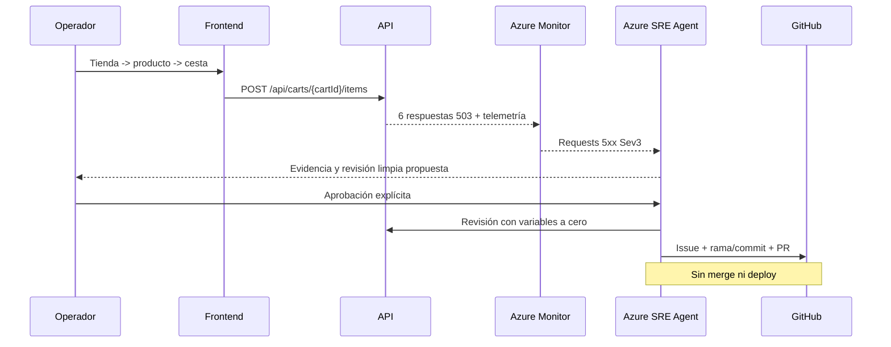

# Guía paso a paso: demo sintética de fiabilidad retail

> **Fictional technical SRE demo. Not an official Mercadona system. All stores, products, prices, carts, orders, correlation IDs and metrics are synthetic; no claims about real operations.**

Esta guía no se conecta a sistemas reales, no utiliza datos ni activos oficiales y no ejecuta nada por sí sola.

## 1. Preparación

Requisitos: PowerShell 7.2+, Azure CLI, .NET 9, Node.js 22, Bicep, GitHub CLI, suscripción `5305e853-a63b-4b82-9a3f-6fde18c1a798`, resource group preexistente `rg-mercadona-sre-agent-v1` y autorización del propietario.

```powershell
az account set --subscription 5305e853-a63b-4b82-9a3f-6fde18c1a798
az group show --name rg-mercadona-sre-agent-v1 --output table
```

## 2. Arquitectura



## 3. Despliegue y configuración

```powershell
.\scripts\deploy.ps1
.\scripts\configure-sre-agent.ps1 -SetGitHubSecret
```

La primera configuración puede detenerse con `INCOMPLETE`. En ese caso realiza solo **Azure SRE Agent portal > Builder > Connectors > GitHub OAuth > Sign in**, habilita issue/contents/pull-request writes y vuelve a ejecutar. No copies tokens.

Resultado esperado: `sre-agent-mercadona-v1` en Review/Low; LAW, App Insights, conector GitHub autenticado (dominio en la API actual) y CodeRepo Ready; herramientas GitHub issue/branch/contents/PR; `incident-handler`; response plan `mercadona-cart-5xx-sev3` por alertId/título/recurso; quickstart competidor ausente; puente MSI seguro.

```powershell
.\scripts\verify-sre-agent.ps1
```

## 4. Línea base e incidente

`start-incident.ps1` verifica por sí mismo la línea base: revisión única sana, variables a cero, alta HTTP 200 sin reserva, cero 5xx recientes, alerta no Fired y configuración SRE completa.

```powershell
.\scripts\start-incident.ps1
```

La revisión incidente usa 10 MiB por alta, umbral controlado 600 MiB y cap 640 MiB. La carga es secuencial y finita: máximo 80 peticiones o cinco minutos. Tras 60 altas con reserva, las siguientes devuelven HTTP 503 real sin reservar ni mutar la cesta. El inyector se detiene al confirmar seis 5xx.

Después espera `Requests 5xx > 5`, la alerta exacta Sev3 Fired y un thread nuevo. No recupera automáticamente.

## 5. Observar

```kusto
ContainerAppConsoleLogs_CL
| where ContainerAppName_s == "ca-mercadona-retail-api"
| where Log_s has_any ("DEMO_CART_MEMORY_RETENTION", "DEMO_CART_MEMORY_CAPACITY_EXHAUSTED")
| project TimeGenerated, RevisionName_s, Log_s
| order by TimeGenerated desc
```

Busca `AllocationBytes=10485760`, crecimiento de `RetainedBytes` hasta 600 MiB, luego `AllocationBytes=0`, `ErrorCode=DEMO_CART_MEMORY_CAPACITY_EXHAUSTED` y el mismo correlation ID que el 503.

## 6. Investigación, aprobación, issue y PR

El agente debe:

1. consultar memoria, Azure Monitor, App Insights, Log Analytics y código;
2. citar la raíz fuerte en archivo/línea;
3. proponer solo una revisión limpia con per-add y failure a cero;
4. esperar aprobación explícita;
5. verificar el flujo sano;
6. crear issue, rama/commit y PR con fix permanente;
7. dejar el PR sin mergear y sin desplegar.

Rechaza cambios de escalado, cap, RBAC, merge, workflow dispatch o deploy.

## 7. Recuperación de emergencia

```powershell
.\scripts\recover-incident.ps1
```

El script es idempotente. Crea una revisión limpia solo si es necesario, valida cesta/alta/pedido/seguimiento y espera la resolución de la alerta exacta. Si Azure Monitor tarda, emite warning y mantiene la demo desactivada.

## 8. Fallback y limpieza

El workflow manual solo acepta un ID `SYNTH-`, o un issue `[SYNTHETIC]` con etiqueta `sre-investigate`. Usa el único secreto `SRE_TRIGGER_URL` y el puente Logic App con identidad administrada. No elimina la frontera Review.

Checklist final:

1. recuperación ejecutada;
2. revisión `Healthy/Running`;
3. `DEMO_CART_MEMORY_MB_PER_ADD=0` y `DEMO_CART_MEMORY_FAILURE_MB=0`;
4. flujo retail sano y sin nuevos 5xx;
5. alerta resuelta;
6. issue/PR/thread sintéticos revisados;
7. PR sin merge ni deploy;
8. `SRE_TRIGGER_URL` retirado al desmontar;
9. recursos dedicados eliminados solo con aprobación.
