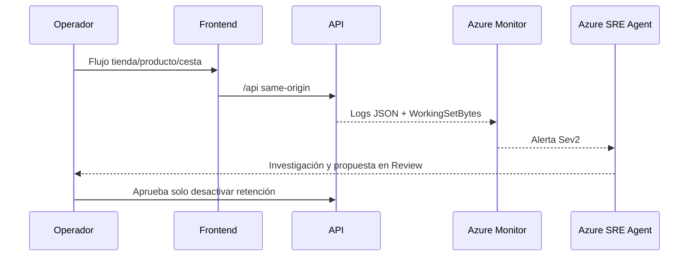

# Guía paso a paso: demo sintética de fiabilidad retail

> **Fictional technical SRE demo. Not an official Mercadona system. All stores, products, prices, carts, orders, correlation IDs and metrics are synthetic; no claims about real operations.**

Esta guía prepara una demostración controlada de Azure SRE Agent. No se conecta a sistemas reales de Mercadona, no utiliza datos reales ni activos oficiales y no realiza ningún despliegue por sí sola.

## 1. Preparación

Comprueba:

- PowerShell 7.2 o superior;
- Azure CLI autenticado;
- suscripción exacta `5305e853-a63b-4b82-9a3f-6fde18c1a798`;
- resource group preexistente `rg-mercadona-sre-agent-v1`;
- .NET 9, Node.js 22, Bicep y GitHub CLI para validación/configuración;
- autorización del propietario para desplegar y generar costes.

```powershell
az account set --subscription 5305e853-a63b-4b82-9a3f-6fde18c1a798
az group show --name rg-mercadona-sre-agent-v1 --output table
```

## 2. Arquitectura



## 3. Despliegue controlado

```powershell
.\scripts\deploy.ps1
```

El script exige el contexto exacto, usa el resource group existente, ejecuta dos pasadas Bicep, compila imágenes remotas en ACR con tags inmutables y valida salud, tienda, cesta, alta de producto, pedido, seguimiento, frontend y proxy same-origin.

Configura después el agente:

```powershell
.\scripts\configure-sre-agent.ps1 -SetGitHubSecret
```

Resultado esperado: agente `sre-agent-mercadona-v1` en `Review/Low`, límite mensual 1000, conectores LAW/App Insights con `id-mercadona-sre-v1`, repositorio listo, subagente `code-analyzer`, filtro `mercadona-cart-memory-sev2`, trigger `mercadona-controlled-issue` y puente seguro.

## 4. Línea base

Antes del incidente:

```powershell
$id = "/subscriptions/5305e853-a63b-4b82-9a3f-6fde18c1a798/resourceGroups/rg-mercadona-sre-agent-v1/providers/Microsoft.App/containerApps/ca-mercadona-retail-api"
az monitor metrics list --resource $id --metric WorkingSetBytes --aggregation Maximum --interval PT1M
```

No continúes si la línea base está cerca de 600 MiB.

## 5. Iniciar incidente

```powershell
.\scripts\start-incident.ps1
```

El script crea una revisión nueva con 10 MiB por alta válida, una única cesta y 64 altas secuenciales correctas. Cada alta devuelve HTTP 200 y correlation ID. La colección queda limitada a 640 MiB. El script espera hasta observar más de 600 MiB.

Tiempo habitual: 3-10 minutos, dependiendo de la publicación de métricas.

## 6. Observar

```kusto
ContainerAppConsoleLogs_CL
| where ContainerAppName_s == "ca-mercadona-retail-api"
| where Log_s has "DEMO_CART_MEMORY_RETENTION"
| project TimeGenerated, RevisionName_s, Log_s
| order by TimeGenerated desc
```

Busca `AllocationBytes=10485760`, `RetainedBytes`, la misma revisión activa y la pista ficticia de colección sin expulsión. Correlaciona después con `WorkingSetBytes`.

## 7. Investigación y aprobación

Azure SRE Agent debe:

1. resumir el impacto sintético;
2. correlacionar métrica, logs, revisión y repositorio;
3. citar evidencia de archivo/línea;
4. proponer únicamente `DEMO_CART_MEMORY_MB_PER_ADD=0`;
5. esperar aprobación humana antes de escribir.

Rechaza cualquier propuesta que cambie escalado, límite, alerta, RBAC o código.

## 8. Fallback de GitHub

Si la alerta tarda demasiado:

1. abre Actions -> **SRE Agent controlled investigation**;
2. ejecuta manualmente con un ID como `SYNTH-DEMO-001`;
3. comprueba HTTP 202, `success=true` y `threadId`.

También se puede ejecutar:

```powershell
.\scripts\create-sample-issue.ps1
```

El workflow solo reacciona a un título `[SYNTHETIC]` con la etiqueta exacta `sre-investigate`. Este fallback no elimina la frontera Review.

## 9. Recuperación obligatoria

```powershell
.\scripts\recover-incident.ps1
```

Se crea una revisión nueva con retención desactivada. El script valida cesta, alta, pedido y seguimiento, comprueba `AllocationBytes=0` y busca una muestra inferior al umbral.

## 10. Costes y limpieza

La demo puede generar costes de Container Apps, ACR, Log Analytics, Application Insights, Azure Monitor, Logic Apps y unidades de Azure SRE Agent.

Checklist final:

1. recuperación ejecutada;
2. revisión nueva `Healthy/Running`;
3. variable de memoria por alta a cero;
4. métrica por debajo de 600 MiB;
5. alerta resuelta;
6. issues y threads sintéticos cerrados;
7. secreto `SRE_TRIGGER_URL` retirado al desmontar;
8. recursos con `purpose=sre-agent-demo` eliminados solo con aprobación.

## 11. Problemas frecuentes

| Síntoma | Acción |
|---|---|
| Guard de contexto falla | no lo eludas; corrige cuenta/suscripción/resource group |
| Revisión no está sana | no generes carga; revisa eventos y logs |
| Las altas no devuelven 200 | detén y recupera |
| La métrica tarda | usa el fallback manual y recupera después |
| Workflow no devuelve 202 | revisa Logic App y rol Standard User al scope exacto |
| El agente sugiere otra acción | rechaza; solo se permite poner la variable a cero |
